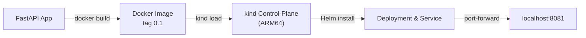

# mlops-lab — FastAPI × Docker × kind × Helm (ARM64)

> **Goal**  
> Build a tiny FastAPI service, containerise it for ARM64, deploy it to a local
> `kind` cluster via a minimal Helm chart, and prove it works with a single
> `curl` command.

---

## Architecture


---

## Quick Start (3 commands)

```bash
# 1  Create a kind cluster (ARM64, Kubernetes v1.29)
kind create cluster --name lab --image kindest/node:v1.29.2

# 2  Build & load the image
docker build -t ml-api:0.1 .
kind load docker-image ml-api:0.1 --name lab

# 3  Deploy with Helm
helm install ml-api ./chart
kubectl port-forward svc/ml-api 8081:80 &
curl http://localhost:8081/healthz        # → {"ok": true}
```

---

## Helm Cheat-Sheet

| Action        | Command                                           |
| ------------- | ------------------------------------------------- |
| **Upgrade**   | `helm upgrade ml-api ./chart --set image.tag=0.2` |
| **Rollback**  | `helm rollback ml-api 1`                          |
| **Uninstall** | `helm uninstall ml-api`                           |

---

## Continuous Integration

*Workflow: `.github/workflows/ci.yml`*
Runs on every PR:

1. Build the image for **linux/arm64** with Buildx
2. Spin up a fresh kind cluster (`helm/kind-action@v1`)
3. `helm upgrade --install` the chart
4. Fail if `kubectl rollout status` is not successful


---

## Troubleshooting Log (key moments)

| Date       | Issue / Error                                        | Root Cause                                   | Fix / Action                                |
| ---------- | ---------------------------------------------------- | -------------------------------------------- | ------------------------------------------- |
| 2025-05-13 | `manifest not found: kindest/node:v1.30.0-arm64`     | Added `-arm64` suffix — not a valid tag      | Use multi-arch tag `kindest/node:v1.29.2`   |
| 2025-05-13 | Helm lint: `nil pointer .Values.autoscaling.enabled` | Block missing in `values.yaml`               | Added `autoscaling:\n  enabled: false`      |
| 2025-05-13 | `cannot re-use a name that is still in use`          | Left-over k8s resources from `kubectl apply` | `helm uninstall ml-api` → clean install     |
| 2025-05-13 | `bind: address already in use` during port-forward   | Port 8080/8081 already taken                 | Switched to 8082 or killed blocking process |
| 2025-05-13 | Accidental PAT leak in chat                          | Human error                                  | Revoked token immediately, issued new PAT   |

---

## TODO

* [ ] Push image to Docker Hub / GHCR (automated via CI)
* [ ] `observability-lab`: Helm-install kube-prometheus-stack, add Grafana dashboards
* [ ] `infra-as-code-eks`: Terraform EKS with GPU node group, deploy this chart
* [ ] Add post-mortem template for incident write-ups

---

© 2025 Teru Murata

```
```
